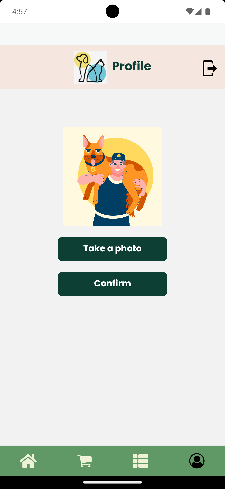
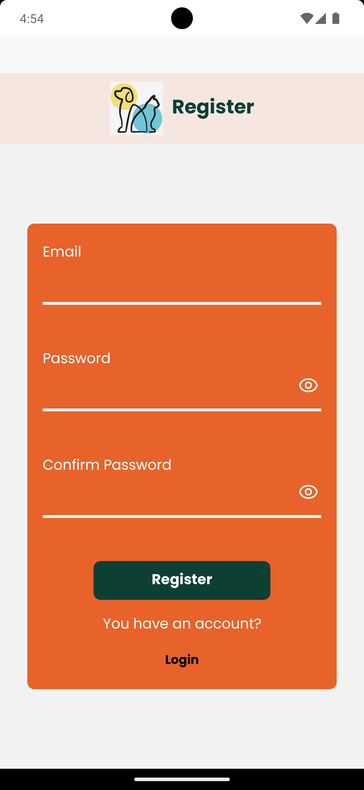
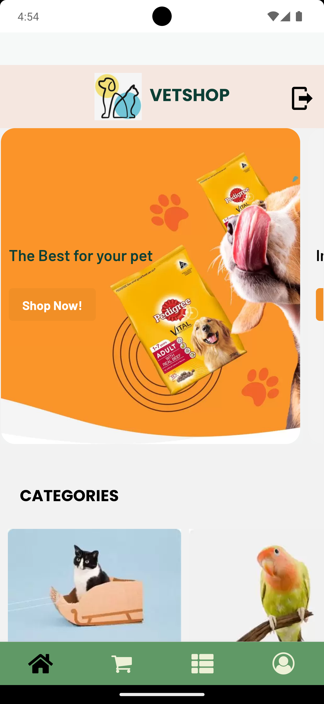
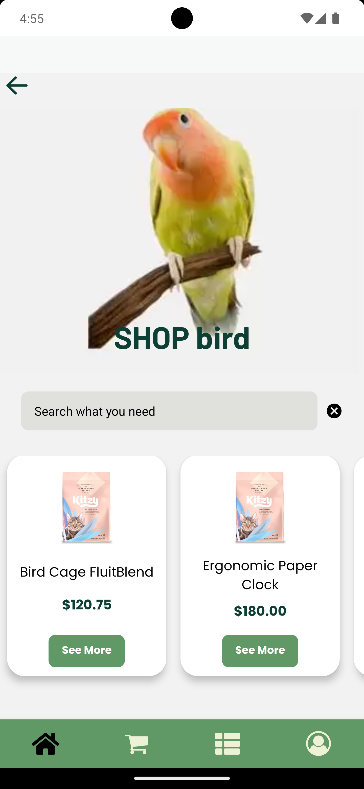
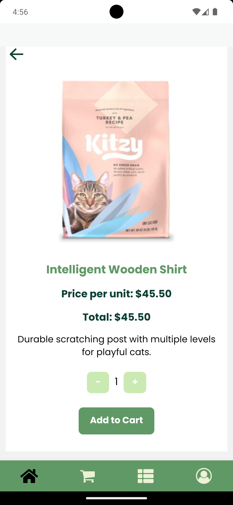
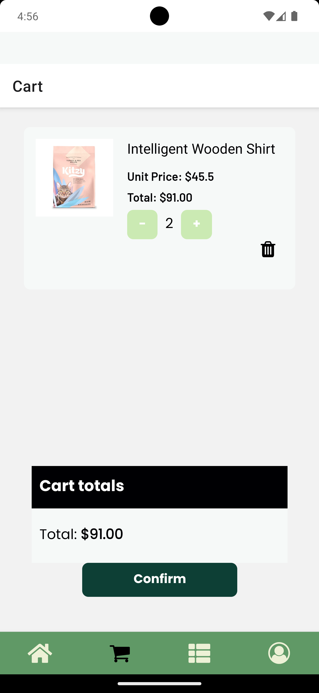
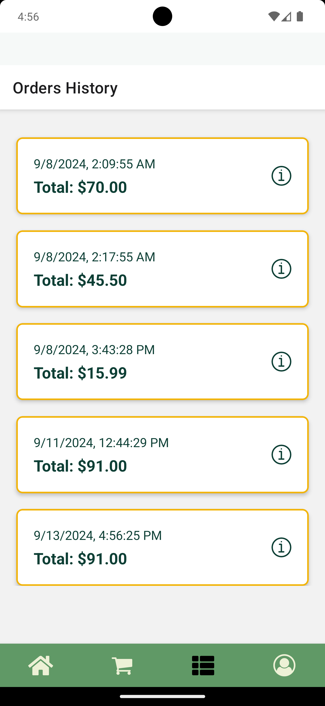
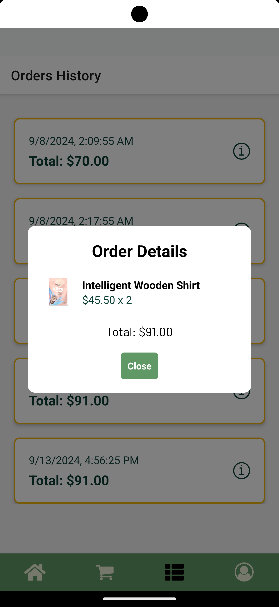

# E-Commerce App - React Native - VETSHOP

A veterinary e-commerce application developed with React Native for the CoderHouse course, offering a complete and user-friendly shopping experience.

## Main Features

### Account Screen

- **Secure access:** Only authenticated users can access the profile screen and make purchases.

### Firebase Authentication

- Uses Firebase's authentication system to manage user access.
- Allows users to log in and register securely.

### Main Screen

- Displays a selection of categories in cards.
- Clicking on a category navigates to the corresponding product screen.
- Clicking on a product navigates to the product details screen.

### Selected Category Screen

- Includes a search bar to filter products by name.
- Clicking on a product navigates to the product details screen.

### Product Details Screen

- Provides a detailed product description.
- Displays the price.
- Allows adding the product to the cart.
- Allows selecting quantities.

### Cart Screen

- Displays cards with the selected products.
- Allows removing orders and modifying quantities.

### Orders Screen

- Displays cards with orders and dates.
- Allows viewing detailed information for each order in a modal.

## Technologies Used

- **Firebase Authentication:** Implements Firebase’s authentication system to manage app security.
- **React Native Navigation Stack:** Manages navigation between screens.
- **React Native Navigation Bottom Tab:** Manages tab navigation.
- **Expo-Picker-Image:** Enables profile image uploading.
- **Redux:** Centralizes and manages the app's state.
- **RTK Query and Firebase:** Handles read/write operations in the database.

## Installation

1. Clone the repository: `git clone https://github.com/Silbordon/EccomerceReactNative`
2. Install dependencies: `npm install`
3. Set up API keys for external services (Expo-Location, Firebase, etc.).
4. Configure Firebase credentials in your project.
5. Run the app: `npm start`

## Contact

For questions or support, contact silbordon.89@gmail.com.

#### *From Silvi with ❤*
